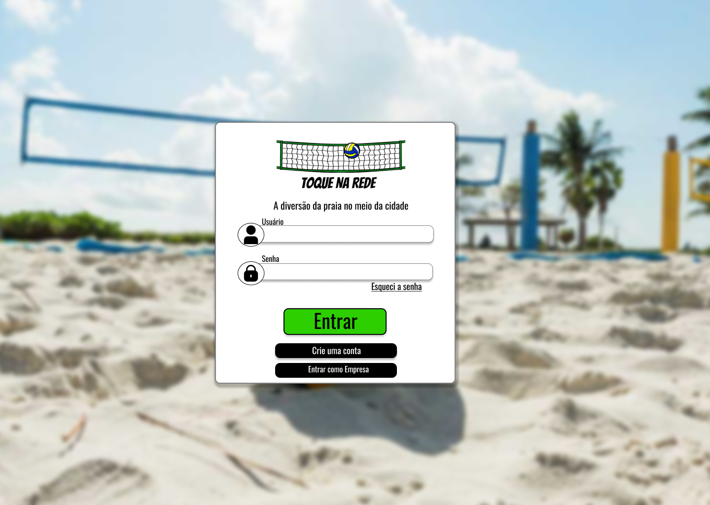

<h1 align="center"> Toque Na Rede </h1>

Esse é um projeto para um Trabalho de Conlcusão de Curso da ETEC Albert Einstein.

  <a href="#-tecnologias">Tecnologias</a>&nbsp;&nbsp;&nbsp;|&nbsp;&nbsp;&nbsp;
  <a href="#-projeto">Projeto</a>&nbsp;&nbsp;&nbsp;|&nbsp;&nbsp;&nbsp;
  <a href="#-layout">Layout</a>&nbsp;&nbsp;&nbsp;|&nbsp;&nbsp;&nbsp;
  <a href="#-integrantes">Integrantes</a>

 

  

---
## 🚀 Tecnologias

Esse projeto foi desenvolvido com as seguintes tecnologias:

- HTML e CSS
- JavaScript
- Git e Github
- Figma
- PHP
- MySql
- phpMyadmin
- Json
- C#
---

## 💻 Projeto

O Toque na Rede serve para facilitar os atletas e as empresas que fornecem arenas de praia para uma fácil comunicação e reservas/day use de arenas.

- Se ficou com curiosidade, você pode visitar o site do [Toque na Rede](http://toquenarede.epizy.com/toquenarede/quemSomos/) por aqui

--- 
## 🔖 Layout

Você pode visualizar o layout do projeto através [DESSE LINK](https://www.figma.com/file/BUdiSOcCIyAcius5hbpI3Y/Toque-na-Rede?node-id=0%3A1&t=G85nsp5mXNQVQC8S-0). É necessário ter conta no [Figma](https://figma.com) para acessá-lo.
---

## 🚹🚺 Integrantes
- [Cleo Leal](https://github.com/CleoLeal) - Back-end e Banco de Dados
- [Cristian Gonçalves](https://github.com/cris-star-oss) - Front-end
- [Elias Mendonça](https://github.com/EliasQueIsso) - Front-end
- [Jullia Barros](https://github.com/Jullia-Barros) - Fron-end
- [Rayssa Portugal](https://github.com/RayssaPortugal) - Front-end

---
